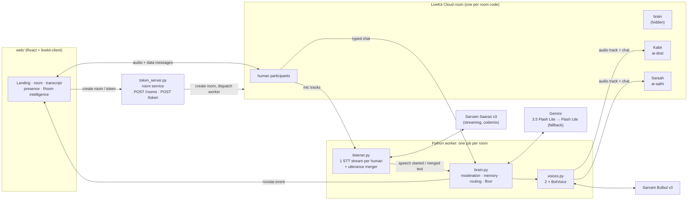
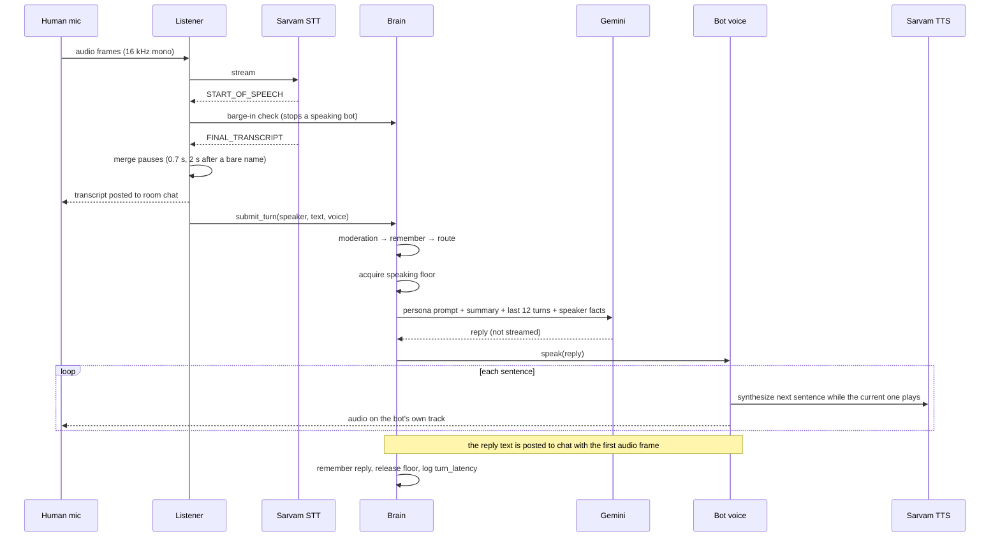
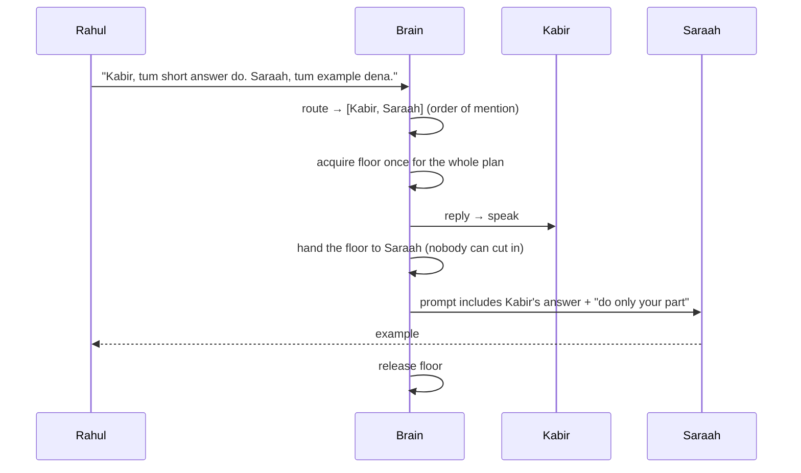

# ROXSTAR AI Voice Room Assistant

This is a real-time voice room built on LiveKit, where several people talk with two AI participants: **Kabir**, a male voice, and **Saraah**, a female voice. People can speak or type. One backend service, the room brain, hears every person on a separate speech-to-text stream. It decides whether an AI should answer and which one, and makes sure only one AI speaks at a time. The AIs answer in everyday Hinglish written in Roman script, spoken with an Indian accent. They understand Hindi, Hinglish and English.

> The web app calls itself **Echo**. Inside the code, Kabir and Saraah use the stable ids `dost` / `ai-dost` and `sathi` / `ai-sathi`, the bots' original names in the assignment. Older design notes in `docs/` still use those names; they mean the same two participants.

---

## Table of Contents
- [Overview](#overview)
- [Key Features](#key-features)
- [Demo](#demo)
- [Architecture](#architecture)
- [How a Turn Works](#how-a-turn-works)
- [AI Participants](#ai-participants)
- [Bot Routing (Turn Selection)](#bot-routing-turn-selection)
- [Context and Memory](#context-and-memory)
- [Interruption (Barge-in)](#interruption-barge-in)
- [Rooms](#rooms)
- [Failure Handling](#failure-handling)
- [Observability and Latency](#observability-and-latency)
- [Technology Decisions](#technology-decisions)
- [Project Structure](#project-structure)
- [Setup and Running](#setup-and-running)
- [Environment Variables](#environment-variables)
- [Testing](#testing)
- [Deployment](#deployment)
- [Privacy and Security](#privacy-and-security)
- [Cost Considerations](#cost-considerations)
- [Assignment Coverage](#assignment-coverage)
- [Known Limitations](#known-limitations)
- [Next Steps](#next-steps)

---

## Overview

The prototype tackles a problem most voice-agent frameworks don't cover: **several humans and two AI participants in one room**. It has to:
- hear everyone, and know who said what
- decide when an AI should speak at all, and which one
- never let two AIs talk over each other
- stop when a person interrupts
- remember the conversation across turns and speakers

The design is **"one brain, two voices"**:
- One worker job per room joins as a hidden **brain**. It listens to every human, routes each turn, holds the speaking lock and calls the LLM.
- Kabir and Saraah are two more LiveKit participants in the same process. They only **speak** (TTS audio) and **post chat**.

Because every decision happens in one process, "only one AI speaks" is one in-process lock rather than a distributed one.

## Key Features

Everything below is in the code and covered by tests or checked live, as noted.

**Real-time communication**
- **LiveKit rooms**, created on demand. Each room has its own code (e.g. `tech-talk-8f3k`) and URL (`/room/<code>`).
- Voice and text chat in the same conversation. Typed messages travel as LiveKit data messages.
- **Join and leave**, with separate AI instances per room.
- **Reconnect in the browser:** the LiveKit SDK retries on its own, and the UI shows "Reconnecting" and offers **Rejoin**.

**AI participants**
- **Kabir** and **Saraah** appear as normal room participants (LiveKit `kind=agent`).
- Distinct personas and prompts. Hindi verbs agree with each bot's gender ("main batata hoon" vs "main batati hoon").
- Distinct Indian voices: Sarvam Bulbul v3, `shubh` for Kabir and `simran` for Saraah.

**Language**
- Understands spoken and typed Hindi, Roman-script Hinglish and English. Speech-to-text runs in Sarvam Saaras v3 `codemix` mode.
- Replies in everyday Roman Hinglish, even to English questions, unless someone asks for English. The prompt carries the assignment's "avoid / prefer" style examples.

**Context**
- **Per-room memory:** the last 12 turns word for word, plus a background summary of older turns.
- **Per-speaker facts** ("mera naam Rahul hai…"), added to the prompt only when that same person is asking.
- **Follow-ups** ("uski", "wahi topic", "simple batao") go to the bot that just spoke, and the prompt quotes its last answer.

**Orchestration**
- Rule-based turn selection: named → follow-up → answer to the bot's own question → question → silence.
- **Speaking floor:** one lock per room, so two AIs can never speak at once. For a two-bot request, the floor is handed from one bot to the other without being released.
- **Name variants:** Saraah is also recognised as Sara / Saara / Sarah / Saraa / सारा when the words are used to address her.

**Voice behaviour**
- Speech is synthesized one sentence at a time. The next sentence is prepared while the current one plays.
- **Barge-in:** when a person starts speaking, the bot stops and its queued audio is dropped.
- A bot's reply text appears in chat at the moment its voice starts.

**Reliability and observability**
- The LLM falls back to a second Gemini model. If both fail, the bot speaks a short Hinglish apology.
- If TTS fails, the reply still arrives as text.
- If speech-to-text fails, it restarts with exponential back-off, and the UI tells that person their voice isn't getting through.
- One latency log line per reply, plus live room events that drive the UI's **Room intelligence** panel and **Debug** timeline.
- Word-list moderation in Roman and Devanagari. A demo-only switch (`/fail llm`, `/fail tts`) triggers the real failure paths on purpose.

## Demo

**▶ [Demo Video](YOUR_DEMO_URL)** *(to be added)*

**🌐 Live deployment: [roxstar-frontend.onrender.com](https://roxstar-frontend.onrender.com/)**. It runs on Render's free tier, so the first visit after a quiet period can take 30–50 s while the backend wakes up. Use headphones so the bots don't hear themselves, and allow the microphone.

What the recording is planned to cover, following the assignment's demonstration checklist. Tick each item once it's in the final video:

- [ ] A LiveKit room with two human participants, created and joined through the landing page
- [ ] Kabir and Saraah visible as room participants
- [ ] A Hindi/Hinglish voice question with a Hindi-accented voice reply
- [ ] An English question with a Hinglish reply
- [ ] A typed question with a context-aware reply
- [ ] A multi-turn follow-up ("simple batao") from a second user
- [ ] Two-bot routing: "Kabir, tum short answer do. Saraah, tum example dena."
- [ ] Interrupting a bot mid-reply
- [ ] One provider failure (`/fail llm` or `/fail tts`, with `ROXSTAR_DEMO_CONTROLS=true`)
- [ ] Logs or metrics for one request (`turn_latency` line and the Room intelligence panel)

## Architecture



| Component | File | Responsibility |
|---|---|---|
| Room service | `src/roxstar/token_server.py` | Creates rooms with a fresh code (title kept in room metadata). Issues room-scoped tokens (1 h), validates names and codes, and dispatches the worker into the room. |
| Worker entry point | `src/roxstar/worker.py` | One job per room: joins as the brain, connects both bots, wires chat, events and shutdown. |
| Listener | `src/roxstar/listener.py` | One Sarvam STT stream per human audio track, the utterance merger, and STT restart with back-off. |
| Brain | `src/roxstar/brain.py` | Every turn goes through moderation → memory → routing → floor → LLM → speech and chat → memory. Also events and the summary. |
| Routing | `src/roxstar/routing.py`, `src/roxstar/names.py` | Which bot answers (if any) and why, plus the bot-name aliases. |
| Memory | `src/roxstar/context.py` | 12-turn window, summary queue, per-speaker facts, routing state. |
| Speaking floor | `src/roxstar/floor.py` | One lock per room, `interrupt()`, and `hand_over()` inside a two-bot plan. |
| Bot voices | `src/roxstar/voices.py` | Each bot's own LiveKit connection: sentence-by-sentence TTS, cancellation, chat posting. |
| LLM | `src/roxstar/llm.py` | Gemini call with a per-model timeout, failover and cooldown. |
| Personas | `src/roxstar/personas.py` | Prompts, display names, voices, and the TTS spoken form of the names. |
| UI | `web/` | Landing page (create / join), `/room/:code`, presence, transcript, controls, Room intelligence and Debug panel. |

Longer write-ups: [`docs/ARCHITECTURE.md`](docs/ARCHITECTURE.md) and [`docs/DECISIONS.md`](docs/DECISIONS.md) (these use the internal names Dost / Sathi).

## How a Turn Works

### Voice turn



**Typed turns** arrive as `roxstar.chat` data messages. `worker.parse_chat` ignores bots, malformed packets and other message types, then passes the text to the same `submit_turn`. So voice and text share one conversation. **Every reply is both spoken and posted to chat.**

### Two bots in one request



## AI Participants

| | Kabir | Saraah |
|---|---|---|
| Internal id / LiveKit identity | `dost` / `ai-dost` | `sathi` / `ai-sathi` |
| Voice | Sarvam `bulbul:v3`, speaker `shubh`, `hi-IN`, 24 kHz | Sarvam `bulbul:v3`, speaker `simran`, `hi-IN`, 24 kHz |
| Persona | friendly, calm, practical, straight to the point | warm, perceptive, builds on what people said |
| Grammar | masculine self-reference | feminine self-reference |

Both bots share one set of rules (`SHARED_RULES` in `personas.py`):
- everyday Roman-script Hinglish, and Hinglish even for English questions (full English only on request)
- no formal or Sanskritized Hindi
- mostly 1–3 sentences
- digits for numbers
- no markdown or stage directions
- "tum" / "aap", never "tu"
- follow-up, recap and interruption behaviour
- never invent facts

The assignment's style examples ("Ek second ruk jao", not "Kripya pratiksha karein") are included word for word.

**How the voice says the names.** Each bot has a display name and an optional *spoken* form used only for TTS. Saraah is spoken as "Saara"; the chat keeps "Saraah". A TTS → STT round trip showed Bulbul already reads "Saraah" as सारा, so the spoken form mainly fixes the pronunciation in place in case the voice or TTS provider changes.

## Bot Routing (Turn Selection)

Routing is rule-based and happens **before** any LLM call (`routing.Router.route`). The rules are checked in order:

| # | Rule | Example | Result |
|---|---|---|---|
| 1 | **Named** | "Kabir, …", "Saraah …", "कबीर, …" | that bot. Both named → both, in the order they were named, one after the other |
| 2 | **Follow-up** within 4 turns of a bot speaking | "uski", "wahi topic", "simple batao", "phir se", "another one" | the bot that spoke last |
| 3 | **Answer** within 2 turns of a bot reply that ended with "?" | "kuch bhi yaar, jo tum chaho" | that bot |
| 4 | **Question / request** not aimed at another human | "AI kya hota hai?", "cloud samjhao" | the bot already in the conversation, else Kabir |
| 5 | **Anything else** | "ohh", "thank you", "mera naam Rahul hai", "Priya, tum kal free ho?" | silence (the turn is still remembered) |

**Name aliases** (`src/roxstar/names.py`). Speech-to-text spells Saraah in many ways, so all of them resolve to the same bot. The display name never changes.
- **Always recognised:** `saraah`, `sarah`, `sarahh`, `sarha`, `साराह`, `सारह`.
- **Recognised only as a form of address:** `sara`, `saara`, `saraa`, `सारा`. That means at the start of a sentence or clause ("Sara, …", "Arre Saara …", "हेलो सारा।") or as "AI Sara". In Hindi *saara* also means "whole" ("sara kaam", "सारा दिन"), so mid-sentence it is not treated as the name.
- **Kabir:** `kabir`, `kabeer`, `kabira`, `कबीर`.
- **The assignment's original phrasing still routes correctly:** "AI Dost, …" and "AI Sathi, …". A bare "dost" is just a word.
- Humans cannot join under the AI names.

**No overlap by construction.**
- Every reply path must hold the room's **speaking floor**, an `asyncio.Lock`, before calling the LLM or speaking. Turns that arrive together wait in order.
- A two-bot plan holds the floor across both replies.
- If the first bot fails or is interrupted, the rest of the plan is dropped.

## Context and Memory

Memory is **per room** (one `RoomMemory` per worker job), **in RAM only**, and **ends with the room**.

| What | How |
|---|---|
| Recent history | The last **12 turns** (humans and bots, labelled by name), word for word, in every prompt |
| Older history | Turns leaving the window are queued. Once **6 or more** pile up, a background Gemini call folds them into a running summary (**at most 120 words**). A reply waits up to 3 s if a summary is being written. If the summary call fails, the turns go back in the queue. |
| Speaker facts | Sentences like "my name is…", "mujhe … pasand hai" are copied to that speaker's own list (**up to 8**). The list outlives the window and is included **only when that speaker is asking**. |
| Follow-ups | The prompt quotes the exact last bot answer and says "apply the request to that answer only" |
| Interruptions | An interrupted reply is stored as a marker ("was interrupted…"), not as text nobody heard |
| Moderation | Abusive turns are stored masked (`***`) |
| Room isolation | Each room is a separate job with its own brain and memory; there is no global conversation state (tested) |

Speaker identity is the LiveKit participant identity, which is the name typed on joining. Attribution is exact, because each human has their own audio track and STT stream.

## Interruption (Barge-in)

1. Sarvam reports `START_OF_SPEECH` on a human's stream, and the listener calls `brain.on_user_started_speaking`.
2. `SpeakingFloor.interrupt()` sets the current reply's cancel event, and an `interrupted` event is published.
3. `BotVoice.speak` checks the event before every audio frame and races every wait against it. When it fires, it **clears the audio queue** and cancels the next sentence's synthesis.
4. The brain stores the interruption marker, drops the rest of the plan, and releases the floor. What the person says becomes the next turn and is routed normally. For example, "Ruko, simple example se samjhao" becomes a follow-up to the same bot.

If the interruption lands while Gemini is still generating, the reply is discarded when it returns.

## Rooms

- **Create:** `POST /rooms {title}` creates a real LiveKit room named by a new code (`<title-slug>-<4 chars>`) and stores the title in room metadata. A created room nobody enters closes after 10 minutes.
- **Join:** `POST /token {name, room, mode: "join"}` does the following:
  - returns **404** if the room doesn't exist
  - returns **409** if the name is already in the room (the name is the LiveKit identity)
  - rejects invalid codes and names
  - otherwise dispatches the worker if the room's brain isn't there, and returns a token for **that room only**
- **Rejoin:** after a dropped connection, `mode: "rejoin"` skips the duplicate-name check.
- **Leave:** the browser disconnects and returns to the landing page.
- **Empty rooms:** when the last human leaves, LiveKit closes the room after about 20 s (the bots don't keep it open), and the room's job ends. The worker also has its own 90 s check as a backup.
- **Dispatch recovery:** if a worker restarted, LiveKit may still list its old dispatch. The room service checks whether the brain is *actually in the room* and replaces a stale dispatch. A 30 s grace period prevents two brains when two people join at once.

## Failure Handling

| Failure | Behaviour | Where |
|---|---|---|
| **STT** stream error (network, provider down, no credits) | That speaker's stream restarts after 2, 4, 8, 16, then every 30 s. An `stt_failed` event is published and `stt_recovered` on the next speech. The UI tells the person, typing still works, and other speakers are unaffected. | `listener._listen` |
| **LLM** error, timeout (5 s per model) or empty reply | The same turn is retried on the fallback model. A failed model is tried last for 60 s. If both fail (or the 12 s overall limit hits), the bot speaks a fixed Hinglish apology, which is not stored in memory. | `llm.gemini_text_fn`, `brain._respond` |
| **TTS** error | The reply is still posted to chat (outcome `text_only`) | `brain._respond` |
| Chat or event publish error | Logged; never breaks the turn or the audio path | `brain._emit`, `listener._emit` |
| Unexpected bug in a turn | Logged as `turn_crashed`; the floor is always released | `brain.submit_turn` |
| Empty / whitespace turn | Ignored | `brain._handle_turn` |
| Browser network drop | livekit-client reconnects, the UI shows Reconnecting / Rejoin, and the server replaces that person's STT stream | `web/src/hooks/useRoomSession.ts`, `listener.py` |
| Worker restart | Rooms get a new brain on the next join (stale dispatch replaced); **that room's memory is lost** | `token_server.prepare_join` |
| Demo | `/fail llm` or `/fail tts` in chat (only with `ROXSTAR_DEMO_CONTROLS=true`) makes the next call fail inside the real error-handling code | `brain.simulate_failure` |

## Observability and Latency

**Logs** (`src/roxstar/log.py`, JSON or text):
- one line per stage: `turn_routed` (speaker, channel, chosen bots, reason), `bot_reply` (length)
- one `turn_latency` line per reply, with `floor_ms`, `llm_ms`, `chat_posted_ms`, `first_audio_ms`, `total_ms` and the outcome
- failure lines: `barge_in`, `llm_failed`, `llm_failover_used`, `tts_failed`, `stt_stream_failed`, `stt_recovered`, `moderation_flagged`, `summary_updated`, `turn_crashed`
- lifecycle lines: `participant_joined` / `left`, `room_empty_shutdown`

Conversation text is logged **only** when `ROXSTAR_LOG_TRANSCRIPTS=true`.

**Room events.** The brain publishes `roxstar.event` data messages:
- `routed`, `thinking`, `turn_done` (with latencies), `interrupted`
- `llm_failed`, `tts_failed`, `moderated`
- `summary_updated`, `failure_armed`, `stt_failed`, `stt_recovered`

Events **never carry conversation text** (tested). The UI's **Room intelligence** panel shows why a bot answered and the last reply's latency; its **Debug** tab shows a timeline of these events.

**Measured latency.** From 17 spoken replies in live tests with `gemini-3.5-flash-lite`, read from `turn_latency` (details in `docs/ARCHITECTURE.md` §7):

| Stage | Median | p90 |
|---|---|---|
| LLM reply | 1.2 s | 3.7 s |
| First bot audio, from the final transcript | 3.0 s | 4.8 s |

These numbers **exclude** STT end-of-speech detection and the 0.7 s pause merge; the documented estimate of what a user feels is about 4–5 s. The largest part is synthesizing the first sentence (about 1.9 s). Gemini latency varied a lot between test sessions.

## Technology Decisions

| Area | Choice | Why | Trade-off |
|---|---|---|---|
| Room and transport | **LiveKit Cloud** + `livekit-agents` 1.8 | Required by the assignment; handles agent dispatch, data messages and agent participants | `AgentSession` is not used: it links only one participant |
| Listening | Own per-human listener | Every human is heard, with exact speaker attribution | More code to own |
| STT | **Sarvam Saaras v3**, `codemix` | Built for Indian languages; keeps English words in Latin script inside Hindi | Mixed-script transcripts; other STT providers were not benchmarked |
| LLM | **Gemini 3.5 Flash Lite**, fallback `gemini-flash-lite-latest` | Only a Gemini key was available. Chosen after side-by-side tests: natural Hinglish, no hidden "thinking" tokens, answered 4/4 while the older model timed out on 2 | Fallback is the same provider; reply is not streamed |
| TTS | **Sarvam Bulbul v3** (`shubh`, `simran`) | Natural Indian voices; English words sound native. ElevenLabs was tried, but its Indian voices needed a paid plan | About 1.9 s for the first sentence |
| Routing | Regex rules | Instant, free, predictable, unit-tested | Keyword-based misses and misfires |
| Concurrency | One process per room, `asyncio.Lock` floor, `asyncio.Event` cancel | Overlap is impossible by construction; cancellation works between audio frames | A room can't span processes |
| Memory | 12-turn window + rolling summary + speaker facts | Flat prompt size, and a recap still covers the whole session | Summary loses detail; RAM only |
| Moderation | Word list (Roman + Devanagari) | Instant, predictable, and the LLM is never called for abuse | No context ("Harami" the film title is flagged) |
| UI | React 19 + Vite + livekit-client (+ components-react hooks) | — | No frontend tests |

More detail: [`docs/DECISIONS.md`](docs/DECISIONS.md).

## Project Structure

```
src/roxstar/
  worker.py        LiveKit worker: one job per room (brain + both bots), empty-room check
  listener.py      one STT stream per human mic, utterance merger, barge-in, STT back-off
  brain.py         every turn: moderation → memory → route → floor → LLM → speak/chat
  routing.py       turn selection rules
  names.py         bot-name aliases (Kabir, Saraah / Sara / Saara / Sarah / सारा …)
  context.py       room memory: 12-turn window, summary queue, speaker facts
  floor.py         the "only one bot speaks" lock
  voices.py        each bot's LiveKit participant: sentence TTS, cancel, chat
  llm.py           Gemini with failover and cooldown
  personas.py      Kabir and Saraah: prompts, voices, spoken names
  moderation.py    abuse word list, masking, fixed replies
  telemetry.py     per-reply latency line
  token_server.py  room service: POST /rooms, POST /token, GET /health
  server.py        hosted entry point: worker + room service in one service
  config.py, log.py, domain.py
web/               React UI (landing, /room/:code, presence, transcript, Room intelligence)
tests/             pytest suite with fake bots and a fake LLM (no network)
docs/              ARCHITECTURE.md, DECISIONS.md
render.yaml        Render Blueprint (backend + static frontend)
```

## Setup and Running

**Prerequisites:**
- Python 3.11+ and Node 18+
- A [LiveKit Cloud](https://cloud.livekit.io) project, a [Sarvam AI](https://www.sarvam.ai) key and a [Gemini](https://aistudio.google.com) key

```bash
python -m venv .venv
.venv\Scripts\activate                 # Windows  (macOS/Linux: source .venv/bin/activate)
pip install -e ".[dev]"
cp .env.example .env                   # then fill in the keys
cd web && npm install
```

**Run it in three terminals, from the repo root:**

```bash
python -m roxstar.worker dev           # 1. the worker (brain + Kabir + Saraah, per room)
python -m roxstar.token_server         # 2. room service on port 8000
cd web && npm run dev                  # 3. the UI on http://localhost:5174
```

**Try it with two people:**
1. **Window 1:** **Create room** → name "Rahul" → optional room name → you get a code with **Copy code / Copy invite link** → **Enter room**.
2. **Window 2:** open the invite link (or **Join room** + the code) → name "Priya".
3. Both people, Kabir and Saraah are now in the same LiveKit room. Speak, or type.

**Demo failure switch:** start the worker with `ROXSTAR_DEMO_CONTROLS=true`, then type `/fail llm` or `/fail tts` in the chat.

**Share a LiveKit project with a deployed worker?** Give the local run its own name, `ROXSTAR_AGENT_NAME=roxstar-local`, for **both** the worker and the room service. Otherwise the deployed worker may take your local rooms.

## Environment Variables

| Variable | Required | Default | Purpose |
|---|---|---|---|
| `LIVEKIT_URL`, `LIVEKIT_API_KEY`, `LIVEKIT_API_SECRET` | yes | — | LiveKit project |
| `SARVAM_API_KEY` | yes (voice) | — | Sarvam STT and TTS |
| `GEMINI_API_KEY` | yes | — | Gemini replies and summaries |
| `GEMINI_MODEL` / `GEMINI_FALLBACK_MODEL` | no | `gemini-3.5-flash-lite` / `gemini-flash-lite-latest` | main and fallback model |
| `SARVAM_STT_MODEL` / `SARVAM_STT_MODE` | no | `saaras:v3` / `codemix` | STT model and mode |
| `ROXSTAR_LOG_LEVEL` / `ROXSTAR_LOG_FORMAT` | no | `INFO` / `json` | logging |
| `ROXSTAR_LOG_TRANSCRIPTS` | no | off | also log conversation text (demo/debug only) |
| `ROXSTAR_DEMO_CONTROLS` | no | off | enables `/fail llm` and `/fail tts` |
| `ROXSTAR_AGENT_NAME` | no | `roxstar` | worker name in LiveKit (same value for worker and room service) |
| `HOST` / `PORT` | no | `0.0.0.0` / `8000` | room service address |
| `VITE_TOKEN_URL` (`web/.env`) | no | `http://127.0.0.1:8000` | where the UI reaches the room service |

Secrets live only in `.env`, which is gitignored. `.env.example` lists every variable with placeholders.

## Testing

```bash
pytest                                                   # 229 tests, no network or keys
ROXSTAR_LIVE_TESTS=1 pytest tests/test_style_live.py -v  # 8 opt-in tests against real Gemini
ruff check src tests
cd web && npm run typecheck && npm run format:check
```

The default suite runs the **real** brain, routing, memory and floor against fake bots and a fake LLM (`tests/fakes.py`).

| Area | Tests | Examples |
|---|---|---|
| Assignment scenarios 1–7 | `test_brain.py` | follow-up quotes the earlier answer; the second user's "simple batao" goes to the same bot; speaker facts recalled only for their owner; barge-in; two-bot order |
| Routing | `test_routing.py`, `test_answers.py` | named (Roman and Devanagari), follow-ups, answers to a bot's question, questions to another human, silence on chatter |
| Name aliases | `test_names.py` | Sara / Saara / Sarah / Saraa / सारा → Saraah; "sara kaam" / "सारा दिन" are not names; Kabir variants; reserved names; spoken name |
| Concurrency | `test_brain.py`, `test_floor.py` | simultaneous turns from two users never overlap; a two-bot plan can't be split; only the holder releases |
| Context | `test_memory.py`, `test_summary_and_moderation.py` | 12-turn window, facts outlive it, interruption marker, summary folding, failed summary loses nothing, recap waits for summary |
| Rooms | `test_rooms.py` | code format and validation, 404 / 409 rules, bots dispatched to the joined room only, a second person doesn't create a second brain, empty-room shutdown, two rooms never share memory |
| Failures | `test_brain.py`, `test_llm.py`, `test_stt_resilience.py`, `test_events.py` | LLM fallback and apology, timeout, TTS → text, crash logging, Gemini failover and cooldown, STT back-off and events, a broken event sink never breaks a turn |
| Voice glue | `test_utterances.py`, `test_livekit_glue.py` | pause merging, sentence splitting, cancellation helper, chat parsing ignores bots |
| Language | `test_personas.py`, `test_style_checker.py`, `test_style_live.py` (opt-in) | Hinglish rule for English questions, style benchmark in the prompt, gender grammar; a style checker for formal words, script, length and markdown against live replies |

**Not covered by automated tests:** real LiveKit connections, real Sarvam audio, the web UI, and English speech-recognition accuracy. These were checked by hand in live rooms. The live style tests have not been re-run since the persona prompt was last edited.

## Deployment

Live: **https://roxstar-frontend.onrender.com/** (the frontend), backed by `https://roxstar-backend-fe1e.onrender.com` (the room service; `/health` returns `{"status": "ok"}`).

`render.yaml` defines two Render services:
- **`roxstar-backend`:** `python -m roxstar.server` runs the worker (production mode) and the room service on `$PORT`, with a health check at `/health`.
- **`roxstar-frontend`:** a static build of `web/`, with SPA rewrites so `/room/<code>` links work. It is given the backend's public URL.

Notes:
- The worker is configured for a small host: jobs start on demand, and the worker never reports itself full. Production defaults (4 pre-started processes, full at 70% CPU) caused restarts and refused rooms on the free tier.
- `render.yaml` currently sets `GEMINI_MODEL=gemini-2.5-flash`, not the code's default `gemini-3.5-flash-lite` that the latency and style work used.
- Free Render services sleep when idle. The first request can take 30–50 s, and no bots are available while the service sleeps.

## Privacy and Security

**What the code does:**
- **Raw audio is not stored.** It is streamed to Sarvam for transcription only.
- **Logs** contain stages, timings, bot names and error types. Conversation text appears only with `ROXSTAR_LOG_TRANSCRIPTS=true`, and API keys are never logged.
- **Room events** carry no conversation text.
- **Memory** is in RAM, per room, and disappears when the room ends.
- **Only the backend holds provider credentials.** The browser receives just a room-scoped LiveKit token and the public LiveKit URL.
- **Input validation:** names are limited to 32 visible characters (control characters removed; the AI names are reserved), titles to 40, and room codes must match a strict pattern.
- **Abusive words** are masked in chat and memory, and never reach the LLM.

**What it doesn't do:**
- **There is no user authentication.** Anyone who can reach the room service can create or join rooms and start the bots.
- **CORS** accepts any origin.
- The room code is the only thing that keeps a room private.

## Cost Considerations

The repository contains no provider prices. These are the cost **drivers** in the current design:

| Provider | What drives the cost | How the design limits it |
|---|---|---|
| **Sarvam STT** | Every human microphone is streamed **for the whole session, including silence**. Cost grows with human-minutes, not questions. | Streams stop when a person leaves; rooms close soon after they empty |
| **Gemini** | One call per responding bot, plus one summary call per 6 or more old turns | Routing happens **before** the LLM (silent turns cost nothing); moderated turns never call it; replies are 1–3 sentences; the prompt is bounded (12 turns, a summary of at most 120 words, 8 facts) |
| **Sarvam TTS** | Characters spoken | Short replies; synthesis stops on interruption |
| **LiveKit** | Participant-minutes: each active room has 3 server-side participants (brain + 2 bots) plus the humans | Empty rooms close after about 20 s |
| **Hosting** | One backend instance runs both the worker and the room service | Free tier works for demos, but sleeps when idle |

Cost per room-hour depends on current provider pricing, and **has not been measured**.

## Assignment Coverage

This table is based on the code and tests in this repository. ✅ means implemented, ⚠️ means partial.

| Requirement | Status | Notes |
|---|---|---|
| LiveKit room; create / join / leave | ✅ | Real LiveKit rooms per code; bots dispatched per room |
| Reconnect | ⚠️ | Browser reconnect and Rejoin work; the worker's own connection drops are left to the SDK; a worker restart loses room memory |
| ≥ 2 humans, AI participants visible | ✅ | Tested live with two browsers |
| Male and female bots with distinct personas | ✅ | Kabir (`shubh`) and Saraah (`simran`), separate prompts and grammar |
| Prevent simultaneous bot speech; documented routing | ✅ | Speaking floor and ordered rules |
| Speech → text, attributed to the right participant | ✅ | One STT stream per human track |
| Pauses / incomplete sentences | ✅ | Utterance merger |
| Transcription errors | ⚠️ | Tolerated implicitly (name aliases, mixed-script rules); no correction |
| Don't answer every sentence | ✅ | Silence rule; see limitations for misfires |
| Voice and text with shared context | ✅ | One pipeline, one memory |
| Multi-turn context, follow-ups | ✅ | Window + summary + quoted last answer |
| Speaker-specific facts kept separate | ⚠️ | Private fact list; recent raw turns are shared room context |
| Barge-in | ✅ | Stops on any human speech start |
| Context-window strategy documented | ✅ | This README and `docs/ARCHITECTURE.md` |
| Hindi / Hinglish / English understanding | ✅ | English speech accuracy not measured |
| Reply mainly in Hinglish unless English is requested | ✅ | Prompt rule; live style test (opt-in) |
| Follow the user's language style | ⚠️ | Replies are always Roman-script Hinglish |
| Indian-accented, distinct voices | ✅ | Chosen by listening tests; subjective |
| Failure handling | ✅ / ⚠️ | STT, LLM and TTS covered and tested; worker-side network loss not handled in code |
| Logging and latency measurement | ✅ | `turn_latency`, events; conversation text opt-in |
| Architecture and sequence diagrams | ✅ | Above and in `docs/` |
| Tests for context, language, routing, failures | ✅ | 229 + 8 opt-in |
| Bonus: summary, speaker memory, moderation, style tests | ✅ | |
| Bonus: dynamic bot selection by language or topic | ⚠️ | Selection uses names and conversation ownership only |
| Demo video | ❌ | Not yet recorded (see [Demo](#demo)) |
| Cost considerations | ⚠️ | Drivers documented; no measured costs |

## Known Limitations

- **Keyword routing:**
  - an English paraphrase like "explain that more simply" is handled as a new question, not a follow-up (it still goes to the same bot, but without the quoted answer)
  - "ok thanks" right after a bot's question gets a reply
  - "saara" mid-sentence is never taken as Saraah's name
- **Barge-in on any human speech:** a cough or two humans talking can stop the bot. There's no minimum speech length and no check of who is being addressed.
- **Typed chat doesn't interrupt** a speaking bot; it waits its turn.
- **No streaming LLM or TTS**, so first audio is about 3 s after the final transcript (about 4–5 s felt).
- **Interrupted LLM calls still finish.** The reply is discarded, but the tokens are spent.
- **No queue expiry or de-duplication:** quickly repeated questions are all answered, in order.
- **RAM-only memory:** lost on worker restart; nothing is kept across sessions.
- **Speaker facts are private only once they leave the 12-turn window.** The summary's "no personal details" rule is an instruction to the LLM, not enforced.
- **Identity = typed name:** names are unique within a room; nothing is verified.
- **Replies are always Roman script,** and English replies still use the `hi-IN` voices.
- **No authentication or rate limiting** on the room service; CORS accepts any origin.
- **Default bot:** unnamed new questions always go to Kabir.
- **Deployment:** free-tier services sleep, the worker and room service share one instance, there is no CI, and `render.yaml` uses a different Gemini model from the code default.

## Next Steps

1. **Latency:** stream Gemini and TTS, so audio starts on the first words.
2. **Barge-in:** require a minimum speech duration, and consider pausing instead of cancelling.
3. **Addressing:** use a small classifier for ambiguous turns, while keeping the rules as the fast path.
4. **Security:** authenticate the room service, restrict CORS, and rate-limit room creation.
5. **Persistence:** checkpoint room memory in Redis, so a worker restart doesn't forget the room.
6. **Operations:** add metrics (latency percentiles, failure rates), run `pytest` / `ruff` / `tsc` in CI, and measure cost per room-hour.
7. **Reliability:** add a second LLM provider for failover.
