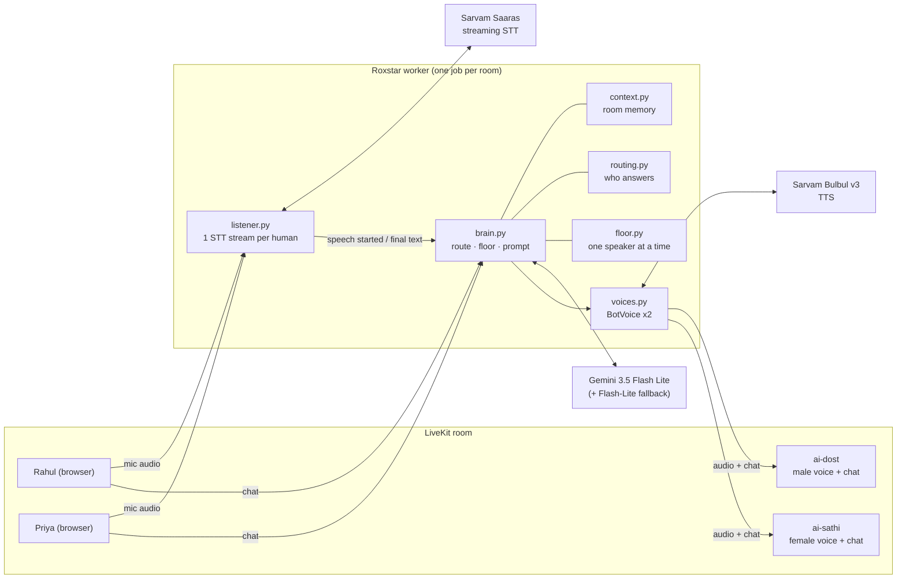
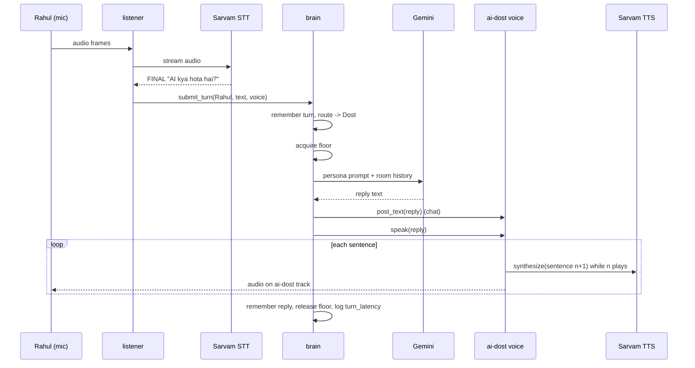
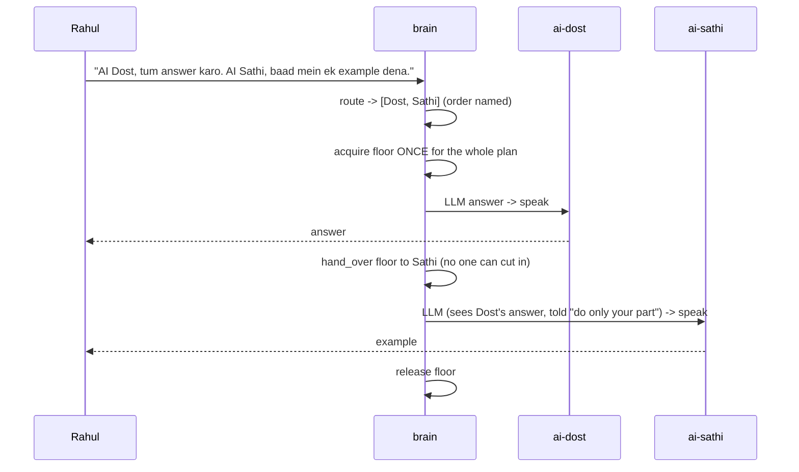
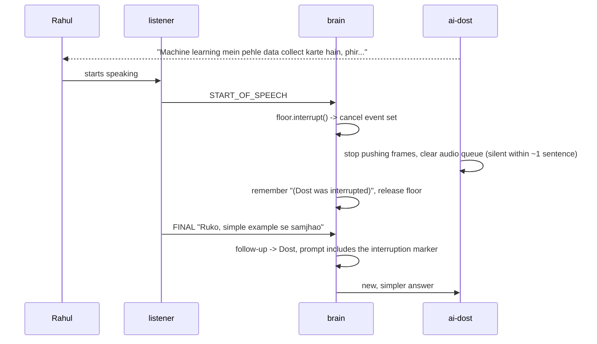

# Architecture

## 1. The idea in one line

**One brain, two voices.** A single "room brain" hears every human, decides who answers, and
holds a speaking floor (a lock) so the two bots — AI Dost and AI Sathi — can never talk at once.
Each bot is its own LiveKit participant with its own voice track and chat identity.

## 2. Components

| File | Job |
|---|---|
| `worker.py` | LiveKit entry point. Joins the room as the brain, connects both bots, wires events. |
| `listener.py` | One Sarvam STT stream per human mic → `speech started` (barge-in) and `final text`. Joins mid-sentence pauses into one turn, and posts what each human said to the chat. |
| `brain.py` | Every turn goes through here: remember → route → take floor → LLM → chat + speak → remember. |
| `routing.py` | Named bot → that bot. Follow-up → last bot. Unnamed question → a bot. Chatter → silence. |
| `context.py` | Last 12 turns + per-speaker facts; builds the prompt's history block. |
| `floor.py` | The lock. One holder at a time; `interrupt()` signals the holder to stop. |
| `voices.py` | A bot's own LiveKit participant: sentence-by-sentence TTS onto its audio track, chat posting. |
| `moderation.py` | Abuse word list (Hindi, Hinglish, English; Roman and Devanagari). Flagged turns get a calm fixed reply and never reach the LLM. |
| `llm.py` | `reply(persona, prompt) -> text` via Gemini 3.5 Flash Lite, failing over to `gemini-flash-lite-latest`. |
| `personas.py` | Who Dost and Sathi are: prompt, voice, LiveKit identity. |
| `telemetry.py` | One `turn_latency` log line per reply with per-stage timings. |
| `token_server.py` | Dev-only: browser tokens + dispatches the worker into the room. |

## 3. Sequences

### A voice question

### Two bots in one request (Scenario 7)

### Barge-in (Scenario 6)

### Provider failure

| Failure | What the room experiences |
|---|---|
| STT stream drops (e.g. provider out of credits) | That speaker's stream retries with back-off (2, 4, 8, 16, 30 s). Each failure is published as `stt_failed`, so the person sees "your voice isn't reaching the AI" by their mic; `stt_recovered` clears it. Other speakers are unaffected. |
| LLM error / slow (>5 s) | Same turn retried on the fallback Gemini model; the failed one is skipped for 60 s (seen live: 503 "high demand" and slow responses). |
| Both models fail | The bot says a short Hinglish apology ("Sorry yaar, connection atak gaya…"). Not stored in memory, but the bot keeps the follow-up. Any second bot in the plan is skipped. |
| TTS error | The reply is already in the chat, so the room still gets the answer as text. |
| Demo: `/fail llm` or `/fail tts` in chat (only with `ROXSTAR_DEMO_CONTROLS=true`) | The next call raises inside the real `try` block, so what you see is exactly the outage behaviour above. One-shot. |
| Any unexpected bug in a turn | Logged as `turn_crashed`; the floor is always released; the next turn works. |

## 4. Routing rules: who answers, and when *not* to answer

1. **Named**: "Dost"/"Sathi" (Roman or Devanagari) → that bot. Both named → both, in order.
2. **Follow-up**: "uski", "simple batao", "yeh bahut lamba hai", "phir se"… within 4 turns of a
   bot speaking → the bot that spoke last.
3. **Answer**: the bot's last reply ended with a question ("Batao, kya discuss karna hai?")
   and a human speaks within 2 turns → that bot hears the answer, even without its name.
4. **Question**: an unnamed question or request ("AI kya hai?", "cloud samjhao", "?") → the bot
   already in the conversation, else AI Dost. Not if it names another human
   ("Priya, tum kab free ho?").
5. **Everything else → silence**: "ohh", "thank you", "mera naam Rahul hai", humans chatting.
   The turn is still remembered.

Rules are regex, not an LLM call: instant, free, predictable, and easy to test. In the first
live test the bot answered "ohh" and "thank you batane ke liye", and rule 4 fixes that.

## 5. Memory (context-window strategy): sliding window + rolling summary

- Sliding window of the **last 12 turns** (humans + bots, labelled by name), word for word.
- **Rolling summary:** turns that leave the window queue up; every 6, a background Gemini call
  folds them into a ≤120-word running summary (never on the reply's critical path). Prompts
  get "summary of earlier conversation" + the recent turns, so "abhi tak kya discuss hua?"
  covers the whole session while the prompt size stays flat. If a summary call fails, the turns
  go back in the queue; nothing is lost. If a reply is being built while a summary is being
  written, it waits up to 3 s for it.
- The summarizer is told to leave out personal details, because the summary is shared
  with everyone while speaker facts stay private.
- **Speaker facts** ("mera naam…", "mujhe … pasand hai") are copied to a per-person list that
  survives the window, and are shown **only when that person is asking**.
- Interrupted replies are stored as a marker, not as text nobody heard.
- Follow-ups: the prompt quotes the exact answer being followed up on, so "simple batao"
  can't drift to an older topic.
- Moderated turns are stored masked ("tu *** hai"), so a slur never reaches a prompt.
- Memory lives in RAM for the room's lifetime. Nothing is written to disk.

## 6. Voice (TTS) configuration

| Setting | Value | Why |
|---|---|---|
| Provider / model | Sarvam Bulbul v3 | Indian voices, handles Hinglish code-mixing |
| AI Dost | `shubh`, male | picked by listening test over aditya, kabir, rahul, varun; natural pace (8.4 s for the test sentence) |
| AI Sathi | `simran`, female | picked by listening test over priya, neha, suhani, kavya; matches Dost's pace (11.2 s vs priya 13.8 s, neha 17.9 s) |
| Language | `hi-IN` | Hindi accent for mixed sentences |
| Sample rate | 24 kHz mono | good voice quality, small frames |
| Input script | Roman Hinglish | verified: TTS → STT round trip returns every word correctly |
| Delivery | sentence by sentence | first audio sooner, fast barge-in |

The LLM is told to write numbers as digits and avoid markdown, so the voice never reads out
"**" or "atharah sau pachve".

## 7. Measured latency

From 17 spoken replies in live tests (2026-09-19), read from the `turn_latency` log lines:

| Stage | Median | p90 | Best |
|---|---|---|---|
| LLM reply (Gemini 3.5 Flash Lite) | 1.2 s | 3.7 s | 0.9 s |
| First bot audio, from the final transcript | **3.0 s** | 4.8 s | 1.6 s |

- About 1.9 s of first-audio time is Sarvam synthesizing the first sentence (HTTP, one sentence at a time).
- Not included in the clock: STT end-of-speech detection (~0.5–1 s) and the 0.7 s pause merge,
  so the delay a user feels is roughly 4–5 s at the median.
- Biggest win left: Sarvam's streaming (WebSocket) TTS to start audio on the first words, not
  the first full sentence; also streaming the LLM reply.

## 8. Privacy

- Raw audio is streamed to Sarvam for transcription and is never stored.
- Logs contain stages, timings, bot names, and error types. Conversation text is logged only
  if `ROXSTAR_LOG_TRANSCRIPTS=true` (for demos). API keys are never logged.
